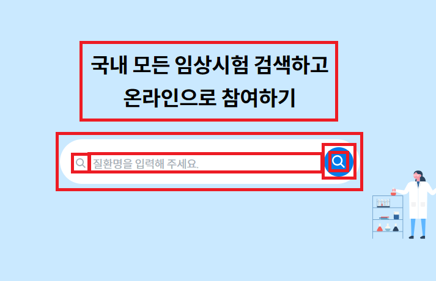
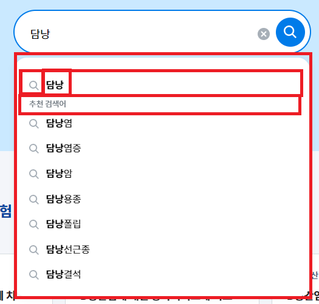

# Wire Frame

## 1. 검색 영역 요소 구분



### 1-1. Landing

```jsx
<Layout>
  <Header />
  <Search />
  <Person1 />
  <Person2 />
  <Person3 />
</Layout>
```

### 1-2. Layout

```jsx
<main>{children}</main>
```

### 1-3. Header

```jsx
<header>
  <h1>국내 모든 임상시검 검색하고</h1>
  <h1>온라인으로 참여하기</h1>
</header>
```

### 1-4. Search

```jsx
<div>
  <form>
    <SearchInput />
    <SearchButton />
  </form>
</div>
```

### 1-5. SearchInput

```jsx
<div>
  <MagnifyingGlass />
  <Input />
</div>
```

### 1-6. SearchButton

```jsx
<button>
  <div>
    <MagnifyingGlass />
  </div>
</button>
```

## 2. List



```jsx
{isFocus ? (
  <ul>
    <ListItem sickNm={list.find((item)=>item===searchValue)}>
    {list.filter((item)=>item!==searchValue).map((sick)=>(
      <li>
        <ListItem sickNm={sick.sickNm} />
      </li>
    ))}
  </ul>
) : null}
```

### 2-1. ListItem

```jsx
<div>
  <MagnifyingGlass />
  {sickNm}
</div>
```
